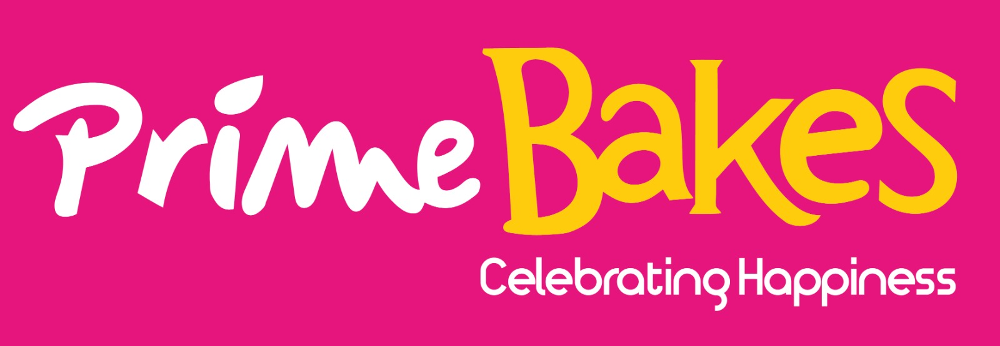

<p align="center">
  
</p>

<h1 align="center">🧁 Prime Bakes</h1>

<p align="center">
  <strong>Enterprise-Grade Restaurant, Store, Inventory, Payroll & Accounts Management System</strong>
</p>

<p align="center">
  <em>A comprehensive business management solution for Salasar Foods Guwahati</em>
</p>

<p align="center">
  
  
  
  
  
  
</p>

<p align="center">
  
  
  
  
  
  
  
</p>

---

## 📋 Table of Contents

- [Overview](#-overview)
- [Key Features](#-key-features)
- [Architecture](#-architecture)
- [The API Split](#-the-api-split)
- [Project Structure](#-project-structure)
- [Technology Stack](#-technology-stack)
- [Modules](#-modules)
- [Database](#️-database)
- [Getting Started](#-getting-started)
- [Deployment](#-deployment)
- [Security](#-security)
- [Platform Support](#-platform-support)
- [License](#-license)

---

## 🎯 Overview

**Prime Bakes** is a full-featured enterprise resource planning (ERP) system designed specifically for bakery and food manufacturing businesses. Built with modern .NET technologies, it provides seamless cross-platform functionality across desktop, mobile, and web environments.

The system handles the complete business lifecycle — raw material procurement, production, finished goods sales, restaurant dine-in billing, employee payroll, and comprehensive financial accounting — with real-time inventory tracking across multiple locations.

One shared Blazor UI is hosted **three** ways — Blazor Server, Blazor WebAssembly, and .NET MAUI Hybrid — and all three talk to a single **HTTP API**. Only the API opens a SQL connection.

<p align="center">
  
</p>

---

## ✨ Key Features

### 🍽️ **Restaurant Management**
- **Dine-In Billing** - Desktop and mobile-optimized POS with table management
- **Dining Areas & Tables** - Area/table configuration for dine-in operations
- **Dining Dashboard** - Live table status overview, desktop and mobile
- **KOT (Kitchen Order Ticket)** - Thermal printing to kitchen printers
- **Bill Thermal Printing** - Instant receipt printing via Bluetooth/USB/direct Windows print
- **Guest QR Menu** - Public, no-login menu page per outlet (`/menu/{locationId}`) with printable QR codes

### 🛒 **Store Management**
- **Point of Sale (POS)** - Desktop and mobile-optimized sales interfaces
- **Order Processing** - Customer order creation, tracking, and mobile ordering
- **Order → Sale Linking** - Orders carry through to sales with fulfilment tracking
- **Sales Returns** - Complete return and refund management
- **Stock Transfers** - Inter-location inventory transfers with dual-location tracking
- **Product Catalog** - Products, product categories, KOT categories, location-specific pricing
- **Customer Management** - Customer database with contact information
- **Tax Configuration** - GST/Tax setup with product-level tax mapping

### 📦 **Inventory Management**
- **Purchase Orders** - Raise POs to suppliers, then convert them into purchases with reference tracking
- **Purchase Entry** - Raw material procurement with supplier tracking
- **Purchase Returns** - Return materials to suppliers
- **Kitchen Issue & Issue Return** - Issue raw materials to production kitchens and take them back
- **Kitchen Production & Production Return** - Record finished goods output and reversals
- **Raw Material Management** - Ingredient catalog with categories and UoM
- **Recipe Management** - Product recipes with Bill of Materials (BOM) and recipe reports
- **Product Stock Adjustment** - Manual finished goods stock corrections
- **Raw Material Stock Adjustment** - Manual raw material stock corrections
- **Multi-Location Stock** - Ledger-style stock across multiple outlets

### 👥 **Payroll**
- **Employee Master** - Employees with department, designation, and location mapping
- **Departments & Designations** - Organisational master data
- **Salary Components** - Earnings, deductions, and employer contributions
- **Formula-Driven Components** - Component amounts computed from expressions (NCalc), with proration and rounding
- **Employee Salary Components** - Per-employee component assignment and values
- **Monthly Attendance** - Present, weekly-off, holiday, paid/unpaid leave, overtime and paid days
- **Payroll Run** - Monthly payroll with gross earnings, deductions, employer contribution and net pay
- **Payroll Reports** - Transaction-level and component-level reports

### 💰 **Financial Accounting**
- **Double-Entry Bookkeeping** - Complete voucher entry system
- **Ledger Management** - Full chart of accounts with groups and account types
- **Company Management** - Multi-company support
- **Voucher Types** - Payment, receipt, journal, contra entries
- **Financial Year Management** - Multi-year period support, with every write guarded against closed years
- **State/UT Configuration** - State and union territory master data
- **Nature & Account Types** - Hierarchical account classification
- **Auto-Posting** - Automatic accounting entries from sales and bills
- **Bank Reconciliation** - Reconcile bank ledger entries against statements

### 📊 **Reporting & Analytics**
Every transaction type has both a **transaction-level** and an **item-level** report, and every report exports to **both PDF and Excel**.

- **Sales / Sale Return / Order / Stock Transfer Reports** - Transaction and item-wise
- **Bill Reports** - Restaurant billing transaction and item reports
- **Purchase Order / Purchase / Purchase Return Reports** - Transaction and item-wise
- **Kitchen Issue / Issue Return / Production / Production Return Reports** - Transaction and item-wise
- **Recipe Reports** - Recipe and recipe-item breakdowns
- **Product & Raw Material Stock Reports** - Summary plus detail (movement) views with valuation
- **Financial Accounting Report** - Voucher-wise accounting transactions
- **Accounting Ledger Report** - Ledger-wise transaction details
- **Trial Balance / Profit & Loss / Balance Sheet** - Company-wise financial statements
- **Payroll Reports** - Payroll run and salary-component breakdowns
- **Audit Trail Report** - Who changed what, when, and from which platform

#### 📈 Summary Reports
A dedicated **Summary Reports** section that pivots and analyses raw transaction data client-side:

| Report | What it shows |
|---|---|
| **Outlet Summary** | Outlet-wise purchase and sale summary |
| **Customer Summary** | Per-customer sales, returns, recency and value analytics |
| **Kitchen Summary** | Kitchen-wise issue and production summary |
| **Sale Item Monthly** | Items as rows × 12 financial-year months as columns (quantity or amount) |
| **Order Item Monthly** | Month-wise item orders with fulfilled/pending split |
| **Purchase Item Monthly** | Month-wise item purchases with rate min/max/variance |
| **Purchase Order Item Monthly** | Month-wise purchase orders with received/pending split |

Monthly reports include hidden analysis columns (rank, contribution %, peak/lowest month, quarterly and half-yearly totals, growth %, consistency %, months idle) revealed via **Show Details**.

#### 🧭 Dashboard Analytics
- **Dashboard Summaries** - At-a-glance figures on the launchpad
- **Dashboard Charts** - Monthly revenue vs. purchase trend, top products, top raw materials
- **Fiori-style Launchpad** - Tabbed, role-filtered tiles grouped into sections per module

### 🧾 **Invoicing & Documents**
- PDF and Excel invoices for purchase, purchase order, sale, sale return, bill, order, stock transfer, kitchen issue/production, accounting and payroll
- **Transaction-number decoding** - Scan or type any transaction number to jump to its page or pull its PDF/Excel
- **Email Integration** - Send invoices and reports via email (MailKit)
- **Blob Attachments** - Document upload/download against transactions (Azure Blob Storage)

### 🔔 **Push Notifications**
- Real-time order and transaction notifications
- Firebase Cloud Messaging integration (Android)
- Azure Notification Hubs backend, fronted by a separate API-key-authenticated API
- Local notification, sound and vibration support on device

### 🖨️ **Printing**
- **Thermal Printing** - Sale, bill, and KOT receipt printing
- **Bluetooth Printing** - Wireless printer support for mobile devices
- **Direct Windows Printing** - Native printer dispatch on the Windows host

### 🔄 **Auto-Updates**
- Automatic update detection against GitHub releases
- Seamless in-app update installation on Android and Windows
- Version gating enforced by CI (see [Deployment](#-deployment))

---

## 🏗 Architecture

```
┌──────────────────────────────────────────────────────────────────────────────┐
│                              CLIENT APPLICATIONS                              │
├────────────────┬────────────────┬────────────────┬───────────────────────────┤
│  📱 Android    │  🍎 iOS/macOS  │  🖥️ Windows    │  🌐 Browser               │
│  MAUI Hybrid   │  MAUI Hybrid   │  MAUI Hybrid   │  Blazor Server + WASM     │
└───────┬────────┴───────┬────────┴───────┬────────┴──────────┬────────────────┘
        │                │                │                   │
        └────────────────┴────────────────┴───────────────────┘
                                  │
                   ┌──────────────┴───────────────┐
                   │   PrimeBakes.Shared          │
                   │   (Razor Class Library)      │
                   │   • Pages & Layouts          │
                   │   • Reusable Components      │
                   │   • Service Interfaces       │
                   └──────────────┬───────────────┘
                                  │
                   ┌──────────────┴───────────────┐
                   │   PrimeBakes.Api.Client      │
                   │   Typed HTTP client that     │
                   │   *impersonates* the data    │
                   │   layer (same namespaces,    │
                   │   classes and signatures)    │
                   └──────────────┬───────────────┘
                                  │  HTTPS + JWT Bearer
                   ┌──────────────┴───────────────┐
                   │   PrimeBakes.Api             │
                   │   ASP.NET Core Minimal API    │
                   │   (Carter modules)           │
                   │   • The ONLY SQL connection  │
                   │   • Output caching           │
                   │   • Response compression     │
                   └──────────────┬───────────────┘
                                  │
                   ┌──────────────┴───────────────┐
                   │  PrimeBakes.Data / .Exports  │
                   │  • Business logic            │
                   │  • Dapper → stored procs     │
                   │  • PDF / Excel / thermal     │
                   └──────────────┬───────────────┘
                                  │
        ┌─────────────────────────┼─────────────────────────┐
        ▼                         ▼                         ▼
┌─────────────────┐   ┌─────────────────┐   ┌──────────────────────┐
│  Azure SQL      │   │  Azure Blob     │   │  Push Notifications  │
│  • 55 Tables    │   │  Storage        │   │  API                 │
│  • 148 Procs    │   │  • Documents    │   │  • Notification Hubs │
│  • 57 Views     │   │  • Attachments  │   │  • Firebase FCM      │
└─────────────────┘   └─────────────────┘   └──────────────────────┘
```

**The UI never touches the database.** It goes through the API, which uses Dapper to call **stored procedures only** — no Entity Framework, no inline SQL.

---

## 🔌 The API Split

`PrimeBakes.Api.Client` sets `<RootNamespace>PrimeBakes.Data</RootNamespace>` and declares **identical namespaces, class names and method signatures** to the real data layer, minus the trailing transaction parameter. `PrimeBakes.Shared` references the client *instead of* the data project, so every UI call site compiles unchanged.

Adding a method therefore means touching **three** files:

| # | File | Role |
|---|------|------|
| 1 | `Data/PrimeBakes.Data/<Module>/<Feature>/Data/XData.cs` | The real implementation |
| 2 | `Api/PrimeBakes.Api/<Module>/<Feature>/Data/XDataEndpoint.cs` | A Carter module exposing it |
| 3 | `Api/PrimeBakes.Api.Client/<Module>/<Feature>/XData.cs` | The mirror the UI actually calls |

Routes are **derived from names, never hardcoded**, via helpers in `Data/PrimeBakes.Models/Common/Helper.cs`:

```csharp
// Api: LocationDataEndpoint.cs
var endpoint = Helper.SanitizeClassName(nameof(LocationDataEndpoint));   // → "Location"
var group = app.MapGroup(endpoint).WithTags(endpoint);
group.MapPost(nameof(LocationData.SaveTransaction),
    (LocationSaveRequest request, int userId, string platform) =>
        LocationData.SaveTransaction(request.Location, request.CopyLocation, userId, platform));

// Api.Client: LocationData.cs  (namespace PrimeBakes.Data.Operations.Location)
private static readonly string _endpoint = Helper.SanitizeClassName(nameof(LocationData));
public static async Task<int> SaveTransaction(LocationModel location, LocationModel copyLocation, int userId, string platform) =>
    await ApiClient.Post<int>(Helper.MakeRouteFromEndpointFunction(_endpoint, nameof(SaveTransaction)),
        new LocationSaveRequest(location, copyLocation), new { userId, platform });
```

Rules that fall out of this:

- A method with **more than one complex parameter** needs a request `record` in `PrimeBakes.Models` — a minimal API can bind only one body. Scalars go in the query string.
- **Arity and parameter order must stay identical** across all three files. A silent mismatch compiles fine and fails only at runtime.
- **`Api.Client` may reference nothing but `PrimeBakes.Models`.** It exists to talk to the API and nothing else.
- Types that don't serialize get a **wire DTO** (e.g. `MemoryStream` → `byte[]`).
- File responses use `TypedResults.File(...)`; uploads use `IFormFile` + `ApiClient.Upload<T>`.

---

## 📁 Project Structure

```
PrimeBakes/                                   # PrimeBakes.slnx
│
├── 📂 Api/
│   ├── 🌐 PrimeBakes.Api/                    # ASP.NET Core Minimal API (Carter)
│   │   ├── <Module>/<Feature>/{Data,Exports}/  →  *Endpoint.cs
│   │   ├── Common/                           # ApiCache, DecodeCode, GenerateCodes endpoints
│   │   ├── StartupConfig.cs                  # JWT, CORS, caching, compression, Scalar docs
│   │   └── Program.cs                        # ← the ONLY project that opens a SQL connection
│   │
│   └── 🔗 PrimeBakes.Api.Client/             # Typed HTTP client impersonating PrimeBakes.Data
│       └── <Module>/<Feature>/               # Mirrors of the Data/Export classes
│
├── 📂 App/
│   ├── 🔗 PrimeBakes.Shared/                 # Shared Blazor UI (Razor Class Library)
│   │   ├── Pages/                            # 108 pages, grouped by module
│   │   │   ├── Accounts/                     # Financial accounting, masters, reports
│   │   │   ├── Inventory/                    # Purchase, purchase order, kitchen, stock, recipe, summary
│   │   │   ├── Operations/                   # Users, locations, settings, audit trail
│   │   │   ├── Payroll/                      # Employees, attendance, payroll run, reports
│   │   │   ├── Restaurant/                   # Bills, dining, guest QR menu
│   │   │   ├── Store/                        # Sales, orders, products, transfers, summary
│   │   │   └── Dashboard.razor               # Fiori-style tabbed launchpad
│   │   ├── Components/
│   │   │   ├── Button/                       # FioriTile, IconButton
│   │   │   ├── Card/                         # BalanceInfoCard
│   │   │   ├── Dashboard/                    # DashboardAnalysis, DashboardChart, DashboardSummaries
│   │   │   ├── Dialog/                       # Confirmation, upload, toast, mobile validation
│   │   │   ├── Grid/                         # CustomGridColumn, GridColumnAggregate
│   │   │   ├── Input/                        # Text, numeric, autocomplete, date, date-range, checkbox
│   │   │   └── Page/                         # Header, Footer, LoadingScreen, CloseGuard
│   │   ├── Layout/                           # Main layout templates
│   │   └── Services/                         # Platform-service interfaces (I*.cs) + AuthenticationService
│   │
│   ├── 📱 PrimeBakes/                        # MAUI Hybrid host (Android/iOS/macOS/Windows)
│   │   ├── Platforms/                        # Bluetooth, direct print, FCM, notifications
│   │   ├── Resources/                        # App icons, splash, fonts
│   │   └── Services/                         # Native service implementations
│   │
│   ├── 🌐 PrimeBakes.Web/                    # Blazor Server host (Azure App Service)
│   └── 🕸️ PrimeBakes.Wasm/                   # Blazor WebAssembly host (Azure Static Web Apps)
│
├── 📂 Data/
│   ├── 📚 PrimeBakes.Data/                   # Business logic + data access (no UI)
│   │   └── <Module>/<Feature>/Data/          # 49 static Data classes
│   ├── 📤 PrimeBakes.Exports/                # PDF, Excel, thermal, QR, mailing (82 classes)
│   │   └── Utils/Exports/                    # Shared invoice/report/thermal/QR utilities
│   ├── 📦 PrimeBakes.Models/                 # POCOs, request records, enums, route & proc names
│   └── 🗄️ PrimeBakes.Database/               # SSDT SQL Server project — schema source of truth
│       └── <Module>/<Feature>/{Table,Insert,Load}/
│
└── 📂 Tools/
    ├── 📤 PushNotificationsAPI/              # Azure Notification Hubs front-end (API-key auth)
    └── 🔧 PrimeBakes.Tools/                  # Scratch console app for one-off bulk imports
```

`PrimeBakes.Data`, `PrimeBakes.Api`, `PrimeBakes.Api.Client` and `PrimeBakes.Database` are all organised **identically, by module then feature** — this parallel is the main thing to know when adding a feature. Modules are `Accounts`, `Inventory`, `Operations`, `Payroll`, `Restaurant`, `Store` (plus `Common`, `DataAccess`, `Utils`).

---

## 🛠 Technology Stack

### **Frontend**
| Technology | Version | Purpose |
|------------|---------|---------|
| **.NET MAUI** | 10.0.100 | Cross-platform native apps |
| **Blazor Hybrid** | 10.0 | UI framework for MAUI |
| **Blazor Server** | 10.0 | Web application hosting |
| **Blazor WebAssembly** | 10.0.11 | Static web app hosting |
| **Syncfusion Blazor** | 34.2.4 | Grid, Inputs, Buttons, Popups, Notifications, Diagram, Themes |
| **MudBlazor** | 9.8.0 | Menus, hotkeys, tabs, dividers |

### **Backend & API**
| Technology | Version | Purpose |
|------------|---------|---------|
| **.NET 10 / C# 14** | 10.0 | Application framework |
| **Carter** | 10.0.0 | Minimal API module organisation |
| **JWT Bearer** | 10.0.11 | API authentication |
| **Scalar.AspNetCore** | 2.17.1 | API reference docs (Development only) |
| **Dapper** | 2.1.79 | Micro-ORM — stored procedures only |
| **Microsoft.Data.SqlClient** | 7.0.2 | Azure SQL Database connectivity |
| **Azure.Storage.Blobs** | 12.29.1 | Document & attachment storage |
| **NCalcSync** | 7.1.0 | Salary-component formula evaluation |

### **Services & Notifications**
| Technology | Version | Purpose |
|------------|---------|---------|
| **ASP.NET Core Web API** | 10.0 | Push notification backend |
| **Azure Notification Hubs** | 4.2.0 | Cross-platform push notifications |
| **Xamarin.Firebase.Messaging** | 125.0.0.1 | Android push notifications |
| **MailKit / MimeKit** | 4.17.0 | Email invoice & report delivery |
| **Plugin.LocalNotification** | 14.1.1 | In-app local notifications |
| **Plugin.Maui.Audio** | 4.0.0 | Notification sounds |

### **Export & Reporting**
| Technology | Version | Purpose |
|------------|---------|---------|
| **Syncfusion.Pdf.Net.Core** | 34.2.4 | PDF invoice & report generation |
| **Syncfusion.XlsIO.Net.Core** | 34.2.4 | Excel export functionality |
| **SkiaSharp** | 3.119.4 | Image processing for exports |
| **QRCoder** | 1.8.0 | Guest-menu QR codes |
| **NumericWordsConversion** | 2.1.1 | Amount-to-words on invoices |

### **DevOps & Tooling**
| Technology | Purpose |
|------------|---------|
| **SQL Server Data Tools (SSDT)** | Database project management |
| **GitHub Actions** | CI build, version gating, releases, and six deployment pipelines |
| **Azure App Service / Static Web Apps** | Web, API and WASM hosting |

---

## 📦 Modules

### 🍽️ Restaurant Module

| Feature | Desktop | Mobile | Description |
|---------|:-------:|:------:|-------------|
| **Bill Entry** | ✅ | ✅ | Create dine-in billing transactions |
| **Dining Dashboard** | ✅ | ✅ | Table status overview with quick actions |
| **Dining Area Management** | ✅ | ❌ | Configure restaurant dining areas |
| **Dining Table Management** | ✅ | ❌ | Configure tables per dining area |
| **Guest QR Menu** | 🌐 | 🌐 | Public per-outlet menu page with printable QR |
| **Bill Reports** | ✅ | ❌ | Transaction-level and item-wise reports |
| **KOT Printing** | ✅ | ✅ | Kitchen order ticket thermal printing |
| **Bill Thermal Print** | ✅ | ✅ | Receipt printing via Bluetooth/USB |

### 🛍️ Store Module

| Feature | Desktop | Mobile | Description |
|---------|:-------:|:------:|-------------|
| **Sale Entry** | ✅ | ✅ | Create sales transactions with POS |
| **Order Entry** | ✅ | ✅ | Process customer orders with mobile flow |
| **Sale Return** | ✅ | ❌ | Handle product returns and refunds |
| **Stock Transfer** | ✅ | ❌ | Transfer inventory between locations |
| **Product Management** | ✅ | ❌ | Product catalog with categories |
| **Product Category** | ✅ | ❌ | Organise products by category |
| **Product Location Pricing** | ✅ | ❌ | Location-specific product rates |
| **KOT Category Management** | ✅ | ❌ | Kitchen order ticket categories |
| **Customer Management** | ✅ | ❌ | Customer database |
| **Tax Configuration** | ✅ | ❌ | GST/Tax setup with product mapping |
| **Sale / Sale Return Reports** | ✅ | ❌ | Transaction and item-wise reports |
| **Order Reports** | ✅ | ❌ | Order transaction and item reports |
| **Stock Transfer Reports** | ✅ | ❌ | Transfer transaction and item reports |
| **Outlet & Customer Summary** | ✅ | ❌ | Consolidated outlet and customer analytics |
| **Sale / Order Item Monthly** | ✅ | ❌ | Month-wise item pivots across a financial year |
| **Sale Thermal Print** | ✅ | ✅ | Receipt printing via Bluetooth/USB |

### 📦 Inventory Module

| Feature | Desktop | Mobile | Description |
|---------|:-------:|:------:|-------------|
| **Purchase Order** | ✅ | ❌ | Raise POs to suppliers, convert to purchases |
| **Purchase Entry** | ✅ | ❌ | Record raw material purchases (with PO reference) |
| **Purchase Return** | ✅ | ❌ | Return materials to suppliers |
| **Kitchen Issue / Issue Return** | ✅ | ❌ | Issue raw materials to production and reverse |
| **Kitchen Production / Return** | ✅ | ❌ | Record finished goods output and reverse |
| **Kitchen Management** | ✅ | ❌ | Configure production kitchens |
| **Raw Material Management** | ✅ | ❌ | Ingredient catalog with categories & UoM |
| **Recipe Management** | ✅ | ❌ | Product recipes with BOM |
| **Product Stock Adjustment** | ✅ | ❌ | Manual finished goods corrections |
| **Raw Material Stock Adjustment** | ✅ | ❌ | Manual raw material corrections |
| **Purchase Order / Purchase Reports** | ✅ | ❌ | Transaction and item-wise reports |
| **Kitchen Reports** | ✅ | ❌ | Issue, production and their return reports |
| **Recipe Reports** | ✅ | ❌ | Recipe and recipe-item reports |
| **Stock Reports** | ✅ | ❌ | Product & raw material stock, summary and detail |
| **Kitchen & Purchase Summary** | ✅ | ❌ | Kitchen summary, purchase/PO item monthly pivots |

### 👥 Payroll Module

| Feature | Desktop | Mobile | Description |
|---------|:-------:|:------:|-------------|
| **Employee Master** | ✅ | ❌ | Employees with department, designation, location |
| **Department Master** | ✅ | ❌ | Organisational departments |
| **Designation Master** | ✅ | ❌ | Job designations |
| **Salary Components** | ✅ | ❌ | Earnings, deductions, employer contributions with formulas |
| **Employee Salary Components** | ✅ | ❌ | Per-employee component assignment |
| **Attendance** | ✅ | ❌ | Monthly present/leave/overtime and paid-day capture |
| **Payroll Run** | ✅ | ❌ | Monthly payroll with gross, deductions and net pay |
| **Payroll Reports** | ✅ | ❌ | Payroll transaction and component reports |

### 💼 Accounts Module

| Feature | Desktop | Mobile | Description |
|---------|:-------:|:------:|-------------|
| **Financial Accounting** | ✅ | ❌ | Voucher entry (payment, receipt, journal, contra) |
| **Ledger Management** | ✅ | ❌ | Chart of accounts with opening balances |
| **Group Management** | ✅ | ❌ | Account grouping by nature |
| **Account Types** | ✅ | ❌ | Account type classification |
| **Company Management** | ✅ | ❌ | Multi-company support |
| **Voucher Management** | ✅ | ❌ | Voucher type configuration |
| **Financial Year** | ✅ | ❌ | Multi-year period management |
| **State/UT Configuration** | ✅ | ❌ | State and union territory master data |
| **Auto Posting** | ✅ | ❌ | Automatic accounting from sales & bills |
| **Financial Accounting Report** | ✅ | ❌ | Voucher-wise transaction report |
| **Accounting Ledger Report** | ✅ | ❌ | Ledger-wise transaction details |
| **Bank Reconciliation** | ✅ | ❌ | Reconcile bank ledger entries |
| **Trial Balance** | ✅ | ❌ | Company-wise trial balance with opening & closing |
| **Profit & Loss** | ✅ | ❌ | Income statement by nature |
| **Balance Sheet** | ✅ | ❌ | Financial position statement |

### ⚙️ Operations Module

| Feature | Desktop | Mobile | Description |
|---------|:-------:|:------:|-------------|
| **User Management** | ✅ | ❌ | Role-based access (Accounts, Inventory, Store, Restaurant, Payroll, Reports, Admin) |
| **Location Management** | ✅ | ❌ | Multi-outlet configuration with ledger mapping |
| **Settings** | ✅ | ❌ | System-wide configuration |
| **Local Settings** | ✅ | ✅ | Device-local preferences and printer pairing |
| **Audit Trail Report** | ✅ | ❌ | Full change history for every transaction |
| **Dashboard Analysis** | ✅ | ❌ | Revenue/purchase trend, top products & raw materials |

---

## 🗃️ Database

The schema lives in `Data/PrimeBakes.Database` as an **SSDT SQL Server project** — the source of truth. It currently holds **55 tables**, **148 stored procedures** and **57 views** across **348 `.sql` files**, organised by module then feature:

```
Data/PrimeBakes.Database/<Module>/<Feature>/{Table,Insert,Load}/
```

### Core patterns

| Pattern | How it works |
|---------|--------------|
| **Stored procedures only** | No EF, no inline SQL. Everything funnels through `SqlDataAccess.LoadData`. |
| **Names are constants** | Proc/table names live in `Data/PrimeBakes.Models/Common/DatabaseNames.cs` (`CommonNames`, `OperationNames`, `AnalysisNames`, `AccountNames`, `InventoryNames`, `StoreNames`, `RestaurantNames`, `PayrollNames`). Never a string literal at a call site. |
| **Generic reads** | `Load_TableData*` procs in `Common/` back `CommonData.LoadTableData<T>`, `…ById`, `…ByStatus`, `…ByMasterId`, `…ByTransactionNo`, `…ByDate`, `LoadLastTableDataBy*`. |
| **`Insert_X` are upserts** | Branch on `@Id = 0` (insert + `SCOPE_IDENTITY()`) vs. non-zero (update), ending with `SELECT @Id AS Id`. |
| **Soft delete** | Records carry a `Status` bool. Delete sets `Status = false` and re-inserts; Recover sets it back. Nothing is hard-deleted. |
| **`X_Overview` views** | Denormalised, human-readable projections (names resolved, not ids) that back the report pages *and* the audit-trail diffs. |
| **Stock is a ledger** | Writes delete stock rows for a `TransactionNo` and re-insert one signed row per detail line — never a running balance. |
| **Audit trail** | Every insert/update/delete/recover writes an audit row inside the same transaction. |
| **Financial year guard** | `FinancialYearData.ValidateFinancialYear` guards every write, including the existing record's date on update. |

### Module coverage

| Module | Features |
|--------|----------|
| **Operations** | User, Location, Settings, AuditTrail, Analysis |
| **Accounts** | FinancialAccounting, Masters (company, ledger, group, voucher, account type, financial year, state/UT) |
| **Inventory** | Purchase, PurchaseOrder, Kitchen, RawMaterial, Recipe, Stock |
| **Store** | Sale, Order, StockTransfer, Product, Customer |
| **Restaurant** | Bill, Dining |
| **Payroll** | Masters (employee, department, designation, salary component), Attendance, PayrollRun |

---

## 🚀 Getting Started

### Prerequisites

- **.NET 10 SDK** or later
- **Visual Studio 2022** (17.14+) with:
  - .NET MAUI workload
  - ASP.NET and web development
  - Data storage and processing (SQL Server Data Tools)
- **Azure Account** (for production deployment)
- **Android SDK** (for Android development)

> The full solution does not build on non-Windows, because the MAUI project targets `net10.0-android;net10.0-ios;net10.0-maccatalyst` (plus `net10.0-windows10.0.19041.0` on Windows). Build individual projects instead.

### Installation

1. **Clone the repository**

   ```bash
   git clone https://github.com/aadipoddar/PrimeBakes.git
   ```

2. **Configure secrets**

   Two partial classes each have a gitignored other half (`*.local_secrets.cs`), reconstructed from GitHub secrets during CI:

   | File | Visibility | Holds |
   |------|-----------|-------|
   | `Data/PrimeBakes.Models/DataAccess/CommonSecrets.cs` | **Client-visible** | `DatabaseConnection` (the `ConnectionType` switch that also selects `ApiBaseUrl`), Syncfusion licence, notification endpoint/key, public URLs |
   | `Data/PrimeBakes.Data/DataAccess/Secrets.cs` | **Server-only** | SQL connection strings, blob storage keys, e-mail credentials, JWT signing key |

   Never reference `Secrets` from `Api.Client`, `Shared`, or any host.

3. **Publish the database**

   Open `Data/PrimeBakes.Database/PrimeBakes.Database.sqlproj` and publish using a profile from `Data/PrimeBakes.Database/PublishLocation/`:
   `LocalDB.publish.xml`, `AzureDBTesting.publish.xml`, or `AzureDB.publish.xml`.

4. **Run the API** — required for every host

   ```bash
   dotnet run --project Api/PrimeBakes.Api
   ```

5. **Run a host**

   **Blazor Server:**
   ```bash
   dotnet run --project App/PrimeBakes.Web
   ```

   **Blazor WebAssembly:**
   ```bash
   dotnet run --project App/PrimeBakes.Wasm
   ```

   **Windows (MAUI):**
   ```bash
   dotnet build App/PrimeBakes/PrimeBakes.csproj -f net10.0-windows10.0.19041.0
   ```

   **Android (MAUI):**
   ```bash
   dotnet build App/PrimeBakes/PrimeBakes.csproj -f net10.0-android
   ```

> For local work set `CommonSecrets.DatabaseConnection = ConnectionType.Local` — that switches both the SQL connection *and* `ApiBaseUrl` to `https://localhost:7273/`. Remember to switch it back; it silently blocks all deploys.

---

## 🌐 Deployment

### Azure Resources

| Resource | Purpose |
|----------|---------|
| Azure SQL Database | Primary data storage |
| Azure Blob Storage | Document attachments |
| Azure App Service (`primebakes`) | Blazor Server web app |
| Azure App Service (`primebakes-api`) | HTTP API |
| Azure Static Web Apps | Blazor WebAssembly app |
| Azure Notification Hubs | Push notifications |

### CI/CD Pipelines

| Workflow | Deploys |
|----------|---------|
| `all-build.yml` | Builds every project on push/PR to `main` |
| `version-checks.yml` | Reusable gate — every deploy calls it first |
| `api-deploy.yml` | API → Azure App Service |
| `web-deploy.yml` | Blazor Server → Azure App Service |
| `wasm-deploy.yml` | Blazor WASM → Azure Static Web Apps |
| `android-deploy.yml` | Signed APK → GitHub Release |
| `windows-deploy.yml` | Windows package → GitHub Release |
| `database-deploy.yml` | SSDT publish to Azure SQL |

### ⚠️ Version gating

Pushing to `main` triggers all six deploys, but each runs `version-checks.yml` first and proceeds **only if all four hold**:

1. the `Latest Version` line at the bottom of this README **changed** versus the previous commit;
2. `CommonSecrets.DatabaseConnection` is `ConnectionType.Azure` (`Local` or `AzureTesting` silently blocks all deploys — a deliberate safety valve);
3. `<AssemblyVersion>` in `PrimeBakes.Shared.csproj` **exactly equals** the README version;
4. `android:versionName` in `Platforms/Android/AndroidManifest.xml` equals the README version **and** `android:versionCode` was incremented.

So a release is: bump all three version strings in lockstep, increment `versionCode`, confirm the connection type. Changing any one alone just makes the pipeline skip.

---

## 🔐 Security

### Authentication
- **Passcode-based login** - `AuthData.Login` validates the passcode and issues a **JWT** valid for 30 days
- **JWT Bearer on the API** - a fallback authorization policy requires an authenticated user on every endpoint; only the landing page and (in Development) the Scalar docs are anonymous
- **Signing key is server-only** - lives in `Secrets.cs`, never in the client-visible `CommonSecrets`
- **Re-validated on every page load** - `AuthenticationService.ValidateUser` re-fetches the user from the server and logs out on failure
- **Role-based access control** - `Accounts`, `Inventory`, `Store`, `Restaurant`, `Payroll`, `Reports`, `Admin` (all requested roles must match)
- **Location-based restrictions** - pages can require `LocationId == 1`; editing an existing transaction requires Admin at location 1

### API Security
- **API Key Authentication** - secures the separate notification API
- **CORS + exposed `Content-Disposition`** - for file downloads
- **Global exception handler** - returns `{ message }` so a validation `throw` in the data layer reaches the user as its original text
- **Secure storage** - encrypted local data storage on devices
- **Notifications and e-mail are suppressed off production** - both open with a connection-string guard

### Data Protection
- Azure SQL with TDE (Transparent Data Encryption)
- Secure blob storage with private access
- HTTPS/TLS for all communications, with response compression enabled
- Full audit trail on every mutation, stamped with user, timestamp and originating platform

---

## 📱 Platform Support

| Platform | Status | Min Version |
|----------|:------:|-------------|
| Windows 10/11 | ✅ | 10.0.17763.0 |
| Android | ✅ | API 24 (Android 7.0) |
| iOS | ✅ | iOS 15.0 |
| macOS (Mac Catalyst) | ✅ | 15.0 |
| Web Browser (Server) | ✅ | Modern browsers |
| Web Browser (WebAssembly) | ✅ | Modern browsers |

`IFormFactor.GetFormFactor()` returns `"Web"` / `"Wasm"` / `"Desktop"` / `"Phone"` / `"Tablet"`, and `GetFormFactor() + GetPlatform()` is stamped into `CreatedFromPlatform` / `LastModifiedFromPlatform` on every record.

Mobile is a **separate set of pages**, not a responsive layout — mobile variants live in `Mobile/` subfolders with their own `-mobile` routes, surfaced from a "Mobile" tab on the dashboard.

---

## 📄 License

This project is proprietary software developed for **Salasar Foods Guwahati**.

---

## 👨‍💻 Development

<p align="center">
  <strong>Developed with ❤️ by <a href="https://aadisoft.vercel.app">AadiSoft</a></strong>
</p>

<p align="center">
  
</p>

---

Latest Version = 1.2.1.4